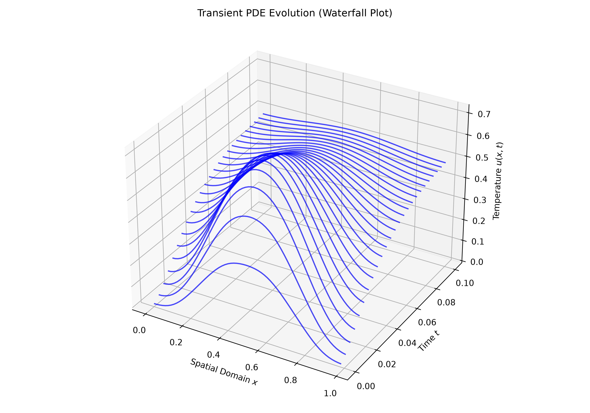

# Spectral PDE Solver

A high-order numerical solver for 1D Parabolic Partial Differential Equations. Doing this with Fourier spectral spatial differentiation paired with an explicit 4th-order Runge-Kutta (RK4).

## Mathematical Formulation

The solver targets non-homogeneous parabolic PDEs of the form:

$$ \frac{\partial u}{\partial t} = D \frac{\partial^2 u}{\partial x^2} + g(x,t) $$

By transforming the spatial domain into frequency space using the Fast Fourier Transform (FFT), spatial derivatives are resolved with exponential accuracy. The continuous PDE is reduced to a system of coupled ODEs for each wavenumber $k$:

$$ \frac{d \hat{u}_k}{dt} = -D (2\pi k)^2 \hat{u}_k + \hat{g}_k(t) $$

## What i found most interesting

1. **Exponential Spectral Convergence:**
   Verified discrete $L_2$ error norm scaling for spatial derivatives.
2. **Explicit Stability Analysis:**
   Analyzed and implemented the theoretical stability boundary for RK4 integration in Fourier space. To maintain numerical stability without artificial damping, the time-step is bounded by:
   
    $$ \Delta t_{\max} = \frac{2.8}{D \pi^2 N^2} $$

## Results & Visualizations



*Figure 1: Waterfall plot demonstrating the transient evolution of $u(x,t)$ subject to a sharp, decaying spatial source term.*

## Installation & Running

```bash
git clone [Spectral PDE solver](https://github.com/Elias-Enander/spectral-pde-solver.git)
cd spectral-pde-solver
pip install -r requirements.txt
python examples/run_heat_equation.py
python examples/run_convergence.py